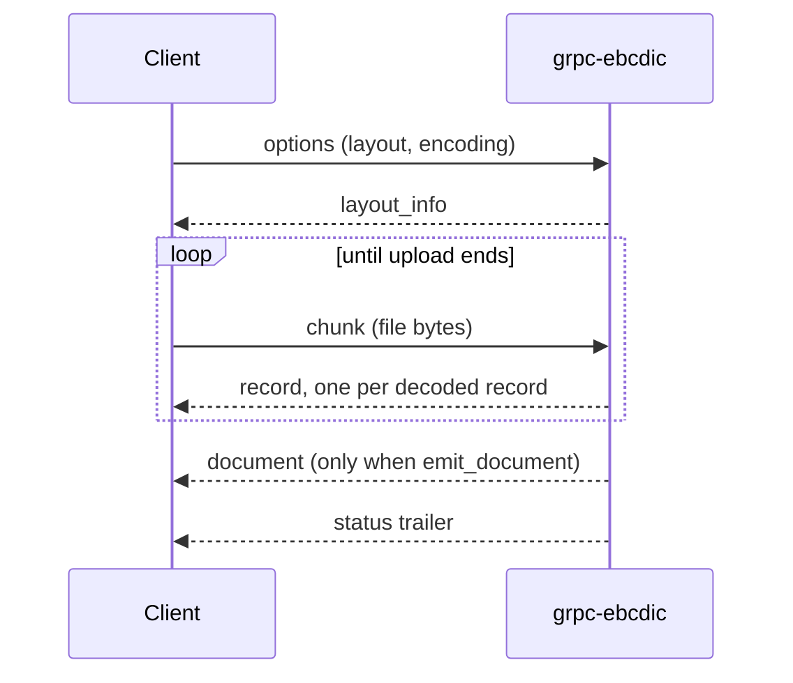

# grpc-ebcdic

gRPC collector for copybook-driven EBCDIC records, projecting into the gRParse
Document data plane.

An `.ebc` file carries no self-describing structure. It is a run of fixed-width
records whose fields only mean something together with the COBOL copybook that
produced them, and without that copybook the bytes are an opaque code page.
This service takes the bytes and the layout, and streams one typed row per
record as the byte walk progresses.

Rows are typed. Packed and zoned decimals stay decimal, binary fields stay
integers, and no value crosses the wire as a float or a JSON blob.

---

## Build and run

```bash
cargo build --release          # protoc is the only non-Rust build dependency
cargo test                     # 116 tests, no network, no fixture files
cargo clippy --all-targets     # pedantic, clean
buf lint                       # STANDARD + COMMENTS, no comment ignores
./target/release/grpc-ebcdic   # listens on 0.0.0.0:50063
```

Container:

```bash
docker build -t grpc-ebcdic .
docker run --rm --read-only --cap-drop=ALL -p 50063:50063 grpc-ebcdic
```

The image is multi-stage; `cargo test` runs inside the build stage and gates
it. The runtime stage is Debian slim, runs as uid 10001, and needs no writable
filesystem: record bytes never leave memory.

Poke it with `grpcurl` (server reflection is registered, so no local protos are
needed):

```bash
grpcurl -plaintext localhost:50063 list
grpcurl -plaintext localhost:50063 ai.pipestream.ebcdic.v1.EbcdicParseService/GetServiceInfo
grpcurl -plaintext localhost:50063 grpc.health.v1.Health/Check
```

---

## Web demo

A dependency-light Node bridge and live viewer, in
[`demos/node-client`](demos/node-client):

```bash
cd demos/node-client
npm install
npm start   # http://127.0.0.1:8089
```

The browser POSTs an `.ebc` file and reads decoded rows off the same response
as Server-Sent Events, one table per record schema, while the upload bar is
still filling. Fixtures with companion layouts (copybook or Docling JSON) live
in [`demos/sample-data`](demos/sample-data). The viewer honours `EBCDIC_ADDR`,
`PORT`, and `UI_BASE` (serve under a path prefix, e.g. `/ui/ebcdic` behind the
demo shell). See its README for details.

---

## Wire API

`ai.pipestream.ebcdic.v1.EbcdicParseService`, defined in
[`proto/ai/pipestream/ebcdic/v1/`](proto/ai/pipestream/ebcdic/v1).

```proto
rpc ParseEbcdic(stream ParseEbcdicRequest) returns (stream ParseEbcdicResponse);
rpc GetServiceInfo(GetServiceInfoRequest) returns (GetServiceInfoResponse);
```

`GetServiceInfoResponse.ui` carries the shared-shell `UiInfo` advertisement
(title, mount path, tooltip) every ai-pipestream service exposes.

### The stream

`ParseEbcdic` is bidirectional. The client sends one `options` frame and then
`chunk` frames of file bytes. The server answers:

| Order | Event | When |
|---|---|---|
| 1 | `layout_info` | before a single input byte is read |
| 2..n | `record` | the moment that record's last byte arrives |
| n+1 | `document` | only when `emit_document` was set; immediately before the trailer |
| last | `status` | once the request stream ends |



Rows are never batched, never reordered, and never held back. Records are
fixed-length, so "this record is complete" is a property of the bytes and not of
the upload finishing: send the first record and hold the stream open and the row
comes back immediately. `tests/parse_stream.rs` asserts exactly that
(`rows_arrive_before_the_input_is_finished`,
`a_row_waits_for_its_last_byte_and_not_a_moment_longer`) and both fail if anyone
turns the stream back into a batch.

`status` is a trailer of counts, warnings, and per-schema row totals. A client
that waits for it before showing anything has misused the stream.

### Options

Set on the first frame. Exactly one layout form is required.

| Field | Default | Meaning |
|---|---|---|
| `encoding` | `cp037` | EBCDIC code page for character data |
| `layout` | one of three required | `EbcdicLayout` protobuf; the canonical form |
| `layout_json` | one of three required | the same `EbcdicLayout` model as JSON bytes, parsed in process |
| `copybook` | one of three required | COBOL copybook source, compiled in process |
| `max_records` | `0` (all) | stop after this many records |
| `strip_control_characters` | `true` | drop Unicode control characters from text |
| `abort_on_error` | `false` | refuse a trailing partial record instead of warning |
| `max_document_mib` | server default (512) | per-stream byte cap |
| `emit_document` | `false` | also fold the parse into one `Document` (see below) |

The three layout forms are a protobuf `oneof`, so "both" cannot be expressed on
the wire. Sending none of them is `INVALID_ARGUMENT`: the bytes are meaningless
without a layout and the server refuses to guess one.

Layouts are always part of the request. There is no server filesystem path,
ever.

### Values on the wire

Types survive. There is no JSON blob and no float anywhere on the value path.

| Field type | Cell |
|---|---|
| `STRING` (`PIC X`, `PIC A`) | `text`, decoded with the code page, controls stripped, trimmed |
| `PACKED_DECIMAL` (`COMP-3`) | `integer` at scale 0, else `Decimal` |
| `ZONED_DECIMAL` (signed `DISPLAY`) | `integer` at scale 0, else `Decimal` |
| `INTEGER` / `UNSIGNED_INTEGER` (`COMP`, `BINARY`) | `integer`, big-endian two's complement |
| `SKIP` (`FILLER`) | no cell; the bytes are consumed |

`Decimal` carries an exact `text` rendering (`"-1234567.89"`), the `scale`, and
an `unscaled` int64 when the value fits in 64 bits. A `PIC S9(18)V99 COMP-3` has
twenty significant digits and an IEEE double has fifteen, so the text is the
field a client can always trust.

### The Document projection

Set `emit_document` and the server also folds the parse into a single
`ai.pipestream.document.v1.Document` and sends it as the `document` event,
once, immediately before `status`. The row stream is unchanged: the `record`
events are still the complete, lossless result, and the Document is a lossy
structural projection layered on top for callers that want the gRParse Document
plane straight from the collector.

The mapping is `docs/design.md` §4 made literal and lives in
`src/document_fold.rs`. The document is flat: no groups at all, everything
hanging off `#/body`. The layout description, when there is one, opens the
document as a `TextItem` labelled `TEXT`. Each record schema gets a
`SectionHeaderItem`, but only when the layout declares more than one schema,
followed by that schema's `TableItem`, which is the heading's sibling, not its
child. A schema that matched no record produces nothing: no heading, no empty
table. Each `TableItem` puts the field names in its first grid row with
`column_header = true`, and fillers are not columns. Every further grid row is
one record, cells aligned by field name; a `Decimal` cell carries `Decimal.text`
character for character, never re-rendered and never a float.

A grid of strings is not enough to work with, so each `TableData` also declares
what is behind it:

- `columns` is one `TableColumnSchema` per column, in layout order and
  index-aligned with the grid, carrying the declared type
  (`packed_decimal`, `zoned_decimal`, `integer`, `unsigned_integer`,
  `string`), the picture clause, the byte offset and width inside the record
  body, the COBOL level number, the field's dotted qualification path
  (`CUSTOMER-RECORD.ADDRESS.STREET`, an `OCCURS` expansion keeping its COBOL
  subscript), the occurrence as a number in `occurs_index`, and the field's
  level-88 conditions in `conditions`. A `FILLER` is still not a column, and
  does not need to be: it is the gap the offsets leave between its neighbours.
- `conditions` is one `ValueCondition` per level-88 name, each holding one
  `ValueRange` per literal: a bare `VALUE 'O'` is a range with `low` and no
  `high`, a `VALUE 1 THRU 3` carries both bounds apart, and a
  `VALUES ARE 'N' 'S' 'E'` is three ranges under the one name. The bounds are
  the copybook's own literals, quotes stripped and nothing else done to them:
  a condition on a `PIC 9` field is not silently turned into numbers, because
  the one on the `PIC X` field beside it has no numbers to be turned into.
- `record_layout` is the fixed-record layout the table was decoded with, as
  typed numbers rather than stringly-typed metadata: the code page in
  `encoding`, the schema's own `record_length`, the `header_bytes`,
  `footer_bytes` and `prefix_bytes` trims, and `rows_truncated`. That last one
  is always set and reads zero for a complete table, because an absent count is
  not a claim that nothing was dropped.
- `TableCell.value` is the cell's number when the field is numeric, beside the
  `text` every reader already reads. The text stays the exact form, because a
  scaled decimal is not generally representable in binary; the number is for
  the consumer who has to compute rather than display.
- `row_prov` is one `ProvenanceItem` per grid row carrying the record's
  `ByteSpan` in the input, which is the only location a record has. The first
  entry belongs to the header row, which was built from the copybook rather
  than read from the input, and so carries no location at all.

Level-88 condition names and the numeric `OCCURS` index also ride the
collector's own contract, in `FieldSchema.conditions` and
`FieldSchema.occurs_index` on the `layout_info` event, which is the lossless
view and the one a client of the row stream reads.
`ConditionName` carries each condition both ways: `ranges` keeps the bounds
apart and is the truth, and `values` keeps the flat `A THRU C` spelling this
field has always had. A joined string cannot say whether a literal contains the
word `THRU` itself, so `values` is a duplicate kept for one release.

Every item the fold creates carries
`CollectorSource{collector: "ebcdic", model: <proto|json|copybook>, version:
<crate version>}` and no `confidence`. There is no `bbox`, no `origin`, and no
pages: this stream has byte offsets and a layout, not a page and not a
filename. A table carries no `prov` of its own either, because the records of
one schema are interleaved with every other schema's and span no single range.
The layout facts are typed, in every table's `data.record_layout`. They are
also still written as the `ebcdic.*` custom fields they used to be, on
`body.meta.custom_fields` and each table's `meta.custom_fields`, and those are
duplicates kept for one release:

| Custom field | Where it is written | Typed home |
|---|---|---|
| `ebcdic.encoding` | body | `data.record_layout.encoding` |
| `ebcdic.header_size` | body | `data.record_layout.header_bytes` |
| `ebcdic.footer_size` | body | `data.record_layout.footer_bytes` |
| `ebcdic.prefix_size` | body | `data.record_layout.prefix_bytes` |
| `ebcdic.record_length` | table | `data.record_layout.record_length` |
| `ebcdic.rows_truncated` | table | `data.record_layout.rows_truncated` |
| `ebcdic.rows` | table | `data.num_rows`, less the header row |
| `ebcdic.layout_source` | body | `CollectorSource.model` |
| `ebcdic.schema` | table | none: it stays a custom field |
| `ebcdic.selector` | table | none: it stays a custom field |

The one asymmetry is `ebcdic.rows_truncated`, which is written only when rows
were dropped, as it always has been, while the typed
`record_layout.rows_truncated` is always set and reads zero for a complete
table. `the_deprecated_layout_custom_fields_are_still_emitted_beside_the_typed_ones`
in `src/document_fold.rs` asserts both halves are written, so the window ends
when someone deletes that test and not by accident.

`ebcdic.schema` deserves a note. A heading names a schema only when the layout
has more than one, so a single-schema document would lose the name entirely.
Every table here says which copybook record it holds, heading or not.

**Use it with a bounded `max_records`.** A Document is one protobuf message and
a mainframe extract is not: the fold has to hold every row it folds until the
parse ends, which is the exact opposite of what the row stream exists for. The
fold therefore caps itself at 100,000 rows per record schema. Rows past the cap
are counted, not folded, and the trailer carries a
`WARNING_CODE_DOCUMENT_ROWS_TRUNCATED` warning naming the schema, the dropped
count, and the byte offset of the first dropped record, with the same count in
that table's `data.record_layout.rows_truncated`. Nothing is capped
silently. A caller who wants a whole Document sets `max_records` below the cap;
a caller who wants every row reads the `record` events, which are never capped.

`document_fold::integrity_errors` checks that the fragment is safe for the
coordinator's additive merge (unique `self_ref`, symmetric parent/child links,
no dangling refs), and every fold test asserts it comes back empty.

### Errors

| Condition | Code |
|---|---|
| No layout, malformed layout, malformed copybook | `INVALID_ARGUMENT` |
| Overlapping fields, duplicate selectors, duplicate field names | `INVALID_ARGUMENT` |
| Bad COMP-3 nibble, non-decimal zoned digit, unassigned code-page byte | `INVALID_ARGUMENT` |
| Record length shorter than its own prefix or than its schema | `INVALID_ARGUMENT` |
| Copybook feature outside the supported subset | `UNIMPLEMENTED` |
| Field wider than the decoders handle | `UNIMPLEMENTED` |
| Input past the byte cap; more parses in flight than admitted | `RESOURCE_EXHAUSTED` |
| Server fault | `INTERNAL` |

A trailing partial record is a warning in the trailer, not a failure, unless
`abort_on_error` is set. Field-level corruption is always fatal regardless of
that flag: a packed field with a bad nibble has no value to report, and
inventing one is how a balance comes back wrong.

---

## Worked example

A customer master file. The copybook, exactly as it comes off the mainframe with
its sequence numbers:

```cobol
000100* Customer master record.
000200 01  CUSTOMER-RECORD.
000300     05  CUST-ID              PIC 9(6).
000400     05  CUST-NAME            PIC X(20).
000500     05  CUST-BALANCE         PIC S9(7)V99 COMP-3.
000600     05  CUST-ORDER-COUNT     PIC S9(4) COMP.
000700     05  FILLER               PIC X(4).
```

Send that as `ParseOptions.copybook` and the server compiles it to a 37-byte
record:

| Field | Offset | Size | Type | Scale |
|---|---|---|---|---|
| `CUST-ID` | 0 | 6 | zoned decimal | 0 |
| `CUST-NAME` | 6 | 20 | string | 0 |
| `CUST-BALANCE` | 26 | 5 | packed decimal | 2 |
| `CUST-ORDER-COUNT` | 31 | 2 | integer | 0 |
| *(filler)* | 33 | 4 | skip | n/a |

One record holding id `1`, name `ACME SUPPLY`, balance `-12345.67`, and `42`
orders is these 37 bytes in cp037:

```
f0 f0 f0 f0 f0 f1                                  CUST-ID           "000001", zoned
c1 c3 d4 c5 40 e2 e4 d7 d7 d3 e8 40 40 40 40 40    CUST-NAME         "ACME SUPPLY" + blanks
40 40 40 40
00 12 34 56 7d                                     CUST-BALANCE      001234567 negative
00 2a                                              CUST-ORDER-COUNT  42, big-endian
40 40 40 40                                        FILLER
```

Note the `d` closing the balance: that nibble is the sign, and `c`/`a`/`e`/`f`
are all positive. One nibble is the difference between a credit and a debit,
which is why the decoder refuses a field it cannot read rather than guessing.

The row that comes back (`grpcurl` output, proto3 defaults elided):

```json
{"record": {
  "recordType": "CUSTOMER-RECORD",
  "cells": [
    {"name": "CUST-ID",          "type": "FIELD_TYPE_ZONED_DECIMAL",  "integer": "1"},
    {"name": "CUST-NAME",        "type": "FIELD_TYPE_STRING",         "text": "ACME SUPPLY"},
    {"name": "CUST-BALANCE",     "type": "FIELD_TYPE_PACKED_DECIMAL",
     "decimal": {"text": "-12345.67", "scale": 2, "unscaled": "-1234567"}},
    {"name": "CUST-ORDER-COUNT", "type": "FIELD_TYPE_INTEGER",        "integer": "42"}
  ]
}}
```

The filler is consumed and never emitted, so the row is four cells, not five.
Before it, `layout_info` carried the resolved schema (offsets, sizes, and the
original picture clauses); after it, `status` reported
`recordsKept: 1, bytesConsumed: 37`.

---

## Copybook support

The `copybook` option compiles the flat subset of COBOL data descriptions that a
record layout is made of. It is not a COBOL compiler: there is no
`PROCEDURE DIVISION`, no `COPY ... REPLACING`, and no attempt to be clever.
Anything outside the subset is `UNIMPLEMENTED` and names the clause that did it,
so a caller finds out their copybook needs hand-normalizing before they ship it
rather than after a table of garbage arrives.

Supported: levels 01 through 49 and 77 (88 condition names declare no storage,
so they become the condition list of the item they follow), group items nested
to any depth and flattened to leaves, each field keeping its level number and
the dotted path of the groups above it, `PIC
X`/`A` character items, `PIC 9` numerics with a leading `S` and one `V`, `USAGE
DISPLAY`, `COMP-3`/`PACKED-DECIMAL`, `COMP`/`COMP-4`/`BINARY`, `OCCURS n` on an
elementary item expanded to `NAME(1)` through `NAME(n)`, each expansion keeping
its one-based index and the name of the item it repeats, `FILLER` and anonymous
items, the byte-neutral clauses (`VALUE`, `JUSTIFIED`, `BLANK WHEN ZERO`,
`GLOBAL`, `EXTERNAL`), and both fixed-format card columns and free format.

Refused, with the reason: `REDEFINES`, level-66 `RENAMES`, `OCCURS DEPENDING
ON`, `COMP-1`/`COMP-2` (hex float), `COMP-5` (native endianness), `SYNCHRONIZED`
(compiler-chosen slack bytes), explicit `SIGN` clauses, `POINTER`/`INDEX`,
numeric-edited and alphanumeric-edited pictures, `P` scaling, `OCCURS` on a
group, and more than one 01-level record.

More than one record schema needs per-schema selectors, which a copybook cannot
express. Use `ParseOptions.layout` for those; see
`a_multi_schema_file_routes_records_by_their_selector` in
`tests/parse_stream.rs`.

## Multi-schema and variable-length files

`EbcdicLayout` carries two optional prefix fields read ahead of every record.
`record_type_field` is decoded and matched against each schema's `selector`. It
is required as soon as a layout has more than one schema; selectors must be
unique, and a record whose type matches nothing is `INVALID_ARGUMENT` because
the walk cannot know how many bytes to skip. `record_length_field` holds the
total record length, prefix included; set it for variable-length records. The
declared length may exceed the schema's extent (the surplus is inter-record
slack and is skipped), while a length shorter than the schema is refused.

`header_size` and `footer_size` bytes are skipped at the boundaries. The footer
is held back incrementally (any byte more than `footer_size` from the
high-water mark is definitely data), so a layout with a footer still streams
rather than buffering the file.

## Code pages

This build carries `cp037` (US/Canada, the default), `cp273`, `cp424`, `cp500`
(international), `cp875`, `cp1026`, and `cp1140` (cp037 with the euro at
`0x9f`). Names resolve through the usual aliases (`IBM-037`, `037`,
`ebcdic-cp-us`, and friends). An unknown name is `INVALID_ARGUMENT` and lists
what is available.

The tables in `src/codepages.rs` are generated from the Python standard library
codecs of the same name, so decoding matches the reference Python codecs byte
for byte. Decoding is strict: a byte the code page leaves unassigned is an
error, not a U+FFFD, because silently substituting a replacement character into
an account number is worse than refusing the record. Regenerate the tables
with:

```bash
python3 - <<'EOF' > /tmp/tables.rs
for name in ["cp037", "cp273", "cp424", "cp500", "cp875", "cp1026", "cp1140"]:
    row = []
    for b in range(256):
        try:
            row.append(ord(bytes([b]).decode(name)))
        except UnicodeDecodeError:
            row.append(0xFFFF)
    print(f"pub(crate) static {name.upper()}: [u16; 256] = [")
    for i in range(0, 256, 16):
        print("    " + " ".join(f"0x{v:04x}," for v in row[i : i + 16]))
    print("];\n")
EOF
```

`cp037` and `cp500` disagree about seven punctuation marks (`0x4a`, `0x4f`,
`0x5a`, `0x5f`, `0xb0`, `0xba`, `0xbb`). Decoding with the wrong one of the pair
produces text that looks plausible and is wrong, which is why `encoding` is a
request option and never a guess.

---

## Environment variables

All optional; see `src/main.rs`.

| Variable | Default | Meaning |
|---|---|---|
| `GRPC_EBCDIC_ADDR` | `0.0.0.0:50063` | listen address |
| `GRPC_EBCDIC_WORKERS` | CPU count | tokio worker threads |
| `GRPC_EBCDIC_MAX_DOCUMENT_MIB` | `512` | byte cap when the request sets none |
| `GRPC_EBCDIC_MAX_CONCURRENT_PARSES` | `64` | parses admitted at once; past it, refused not queued |
| `GRPC_EBCDIC_METRICS_INTERVAL_SECONDS` | `60` | metrics line interval; `0` disables |
| `GRPC_EBCDIC_WINDOW_BYTES` | 16 MiB | HTTP/2 initial stream and connection window |

Metrics are one line on stdout per interval:

```
grpc-ebcdic metrics: parses{started=12,completed=11,failed=1,rejected=0} records=48213 bytes=1784341 byte_cap_hits=0
```

`grpc.health.v1.Health` and server reflection are both registered, and
`tests/server_wiring.rs` fails if either is dropped from the binary's wiring.

---

## Tests

```bash
cargo test
```

116 tests, none of which touch the network beyond localhost or the disk at all.
There are no fixture files: every record is assembled in the test from a
copybook written as a string literal plus an EBCDIC encoder that writes zoned,
packed, and binary fields from the COBOL definitions. A round trip is therefore
a real check rather than a comparison of one opaque blob to another.

Mandatory cases, all present: truncated record, bad nibble in COMP-3,
non-decimal zoned digit, three code pages over the same bytes, missing layout,
control-character stripping on and off, byte cap, concurrency cap, unsupported
copybook feature, malformed copybook, multi-schema selectors, header/footer, the
folded document's column declarations, typed cell values and per-row byte
extents, and the two anti-batch stream assertions.

The Document fold has its own: `src/document_fold.rs` drives real events from a
real walk into the fold and asserts the flat body order (description, then
heading and table per schema), the heading only when there is more than one
schema, the skipping of a schema that matched no record, the header row, the
exact decimal text, the source stamps, the typed `record_layout` (code page,
record length, byte trims, and a truncation count that reads zero for a
complete table), the level-88 conditions on the columns for a single literal, a
`THRU` range and a list of literals, the row cap's warning and counter, the
`ebcdic.*` custom fields still being emitted through their deprecation window,
and, every time, that `integrity_errors` is empty.
`tests/parse_stream.rs` proves the wire contract: the event order is exactly
`layout_info, record..., document, status`, the document arrives once and only
when asked for, and `emit_document = false` leaves the stream byte-identical to
what it always was.

---

## Docs

- [Architecture](docs/architecture.md): where this sits in the collector fleet
- [Design](docs/design.md): wire API, Document mapping, tests
- [Guidelines](docs/guidelines.md): how to build it so it matches the fleet
- [`AGENTS.md`](AGENTS.md): read order, definition of done, git

### Where the implementation departs from `docs/design.md`

**Event types are named `*Response`.** `design.md` §3 sketches
`ParseEbcdicEvent`; buf's `STANDARD` lint requires an RPC's response type to be
`<RpcName>Response`, so the oneof lives inside `ParseEbcdicResponse`.

**Fields carry `size`, not `offset`/`length`.** `design.md` §5 sketches
`offset`/`length` per field; the layout model this service implements carries
`size` with offsets implied by physical record order. `offset` is accepted as
an optional cross-check that can declare a gap but never an overlap, which is
what makes §5's "overlapping fields are `INVALID_ARGUMENT`" a rule with
something to check.

**A copybook compiler exists.** `design.md` §2 makes "compiling arbitrary COBOL
source" a v1 non-goal. The compiler here is not that: it handles the flat
`level / name / PIC / USAGE` subset and refuses everything else by name. It is
additive (the protobuf and JSON layout forms are unchanged and remain
canonical), and it is what gives the fleet's
`UNIMPLEMENTED`-for-unsupported-copybook-feature rule something to be about. See
`src/copybook.rs`.

**A trailing partial record warns; a short field does not.** `design.md` §6
asks for the warning. This build also refuses a field whose bytes run past the
end of a length-prefixed record rather than silently truncating it.

**The `Document` mapping is opt-in and bounded.** `design.md` §4 describes one
`TableItem` per record schema and is now implemented here, behind
`emit_document`. §4 also argued that streaming rows is what keeps a 10 M-row
dump from inflating one event, and that argument still stands: the fold is off
by default, and when it is on it caps itself per schema and reports what it
dropped rather than pretending a Document can hold an extract. gRParse wiring
(the `COLLECTOR_*` enum, the endpoint) remains the follow-up `AGENTS.md`
describes.

---

## Remotes

- **Forgejo** (`git.rokkon.com/ai-pipestream/grpc-ebcdic`) is the source of
  truth. `main` lives here.
- **GitHub** is a public push-mirror of `main`. Do not merge to GitHub `main`.
- GitHub's default branch is `development` so LLM / `gh` work lands there
  instead of clobbering the mirror.

Push Forgejo first. GitHub `main` updates from the Forgejo push-mirror.
