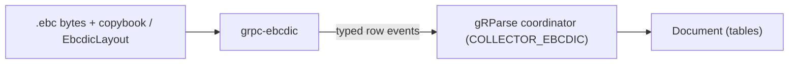

# grpc-ebcdic architecture

**Status:** spec (no implementation yet)
**Updated:** 2026-08-13

Implementers start at [`AGENTS.md`](../AGENTS.md), then this file, `design.md`, and `guidelines.md`.

## Where this sits

EBCDIC is not "just text." A `.ebc` file is a stream of fixed-width records
whose fields only mean something together with the COBOL copybook (or
equivalent layout) that produced them. This service takes the bytes plus the
layout over gRPC and emits one table per record schema.

Without a layout the bytes are an opaque code page. We refuse to guess.

## Live results

A batch parse decodes the file into tables and returns one document at the
end. This service streams rows as each record decodes, so a UI can show a dump
filling in and a 10 M-row file does not become one frozen table in RAM.
`LayoutInfo` is the first event; `ParseStatus` is a trailer.

## What this process owns

The process decodes character fields with a named EBCDIC codec (`cp037`,
`cp500`, `cp1140`, and the rest of the carried set). It unpacks the COBOL
numeric usages: `DISPLAY`, `COMP-3` packed, zoned decimal, signs in nibbles.
It produces one `TableItem` per record type in the layout, with rows streamed.
It honors the request knobs `max_records` and `strip_control_characters`.

## What this process does not own

| Concern | Owner |
|---|---|
| Inventing a copybook from the file | out of scope |
| VSAM / IMS / mainframe connectivity | a connector, not a parser |
| EBCDIC inside a PDF or office doc | not this format |
| Export to CSV | protomolt sink, from the table |

## Language

Rust. The decode is a tight byte walk; no GC on the per-record path. Codecs
come from a small generated EBCDIC table. The layout is a protobuf message,
optionally the same model as JSON bytes parsed in process: the client sends
the bytes, we never read a server path.
